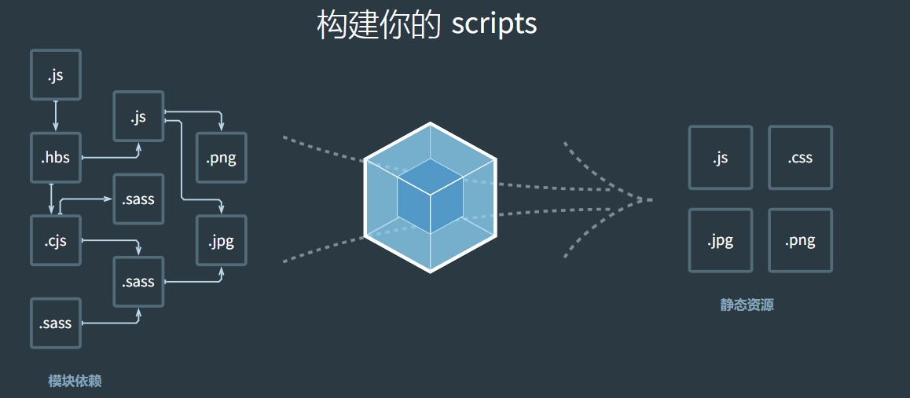
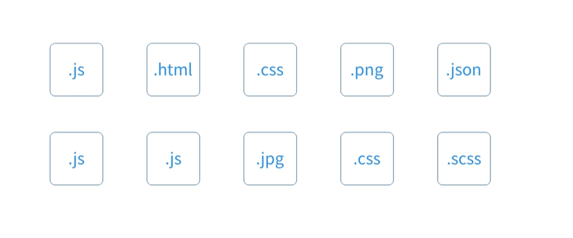
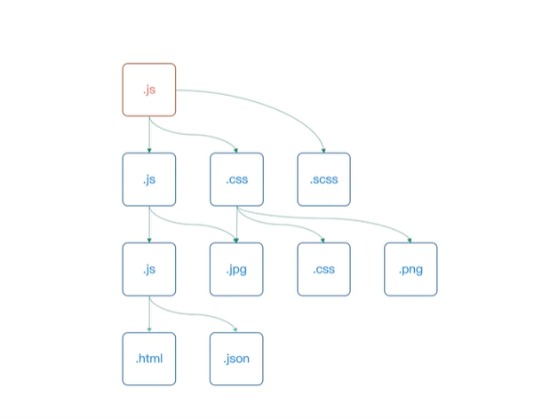
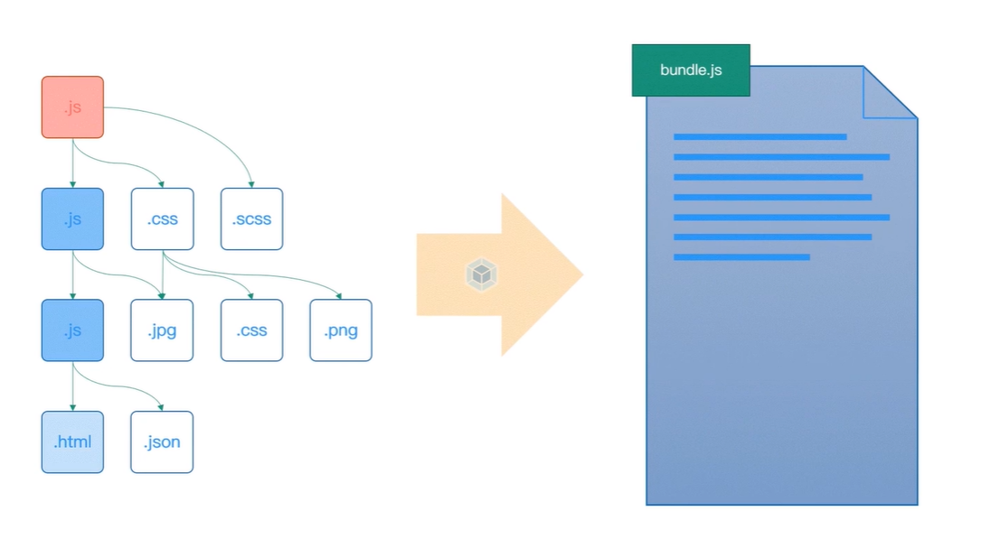
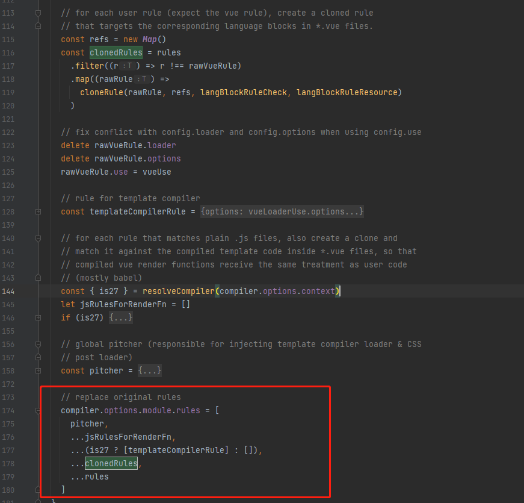
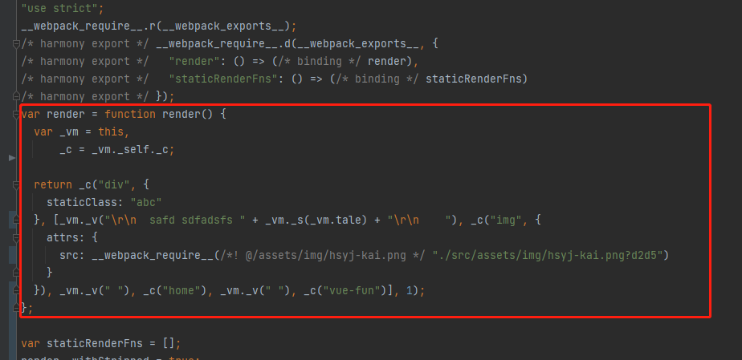
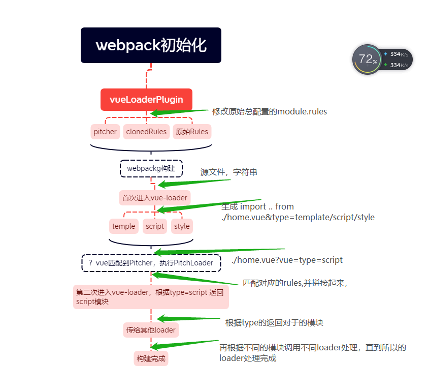
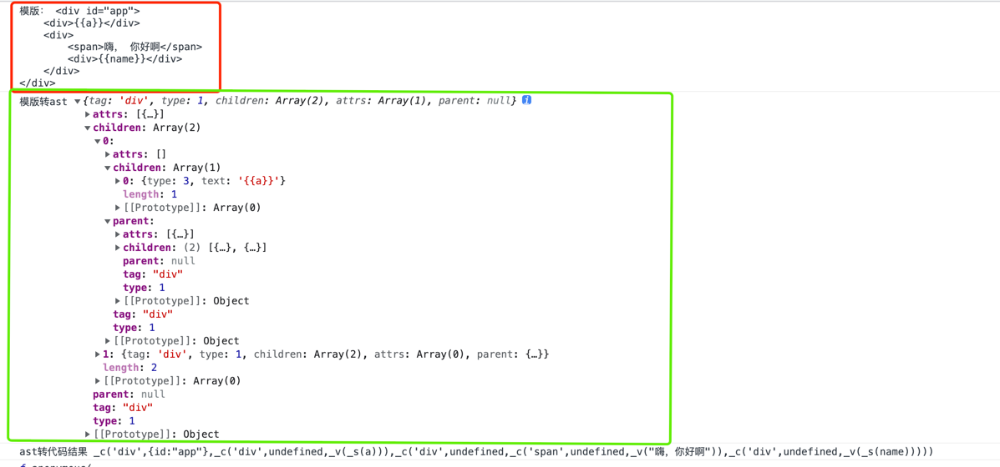

# 前端工程化过程

> 今天我们就来说说前端的发展历程，和火热的webpack工程vue框架

讲解前端的工程化，那我们不得不先了解一下前端模块化的历史进程


首先先给大家演示一下最早起的web开发方式。那个时候还没有前后分离，
通过 `shop` 这个项目  启动 node app.js

## 1.前端模块化历史进程

在早期的前端开发中，并没有模块的概念，模块只在服务端存在，用于处理复杂的业务通行等。直到AJAX被提出，前端能够向后端请求数据，前端逻辑越来越复杂，就出现许多的问题：
全局变量，函数名冲突，依赖管理不好处理。。。 随着业务逻辑的增加，对模块需求越来越大，所有才有来后续一些列 `AMD` 、`commonJS` `ES6Module`规范

下面主要简介以下几个代价性模块化阶段

**1. 文件划分方式**

 最早期我们会基于文件划分的方式来实现模块化，也就是web最原始的模块系统，具体做法就是将每个功能相关状态数据单独放到不同的js文件中，预定每个文件都是一个独立的模块，使用某个模块将这个模块引入到页面中，一个`script`标签对应一个模块，然后直接调用模块中的成员（变量/函数）
```html
<!DOCTYPE html>
<html lang="en">
<head>
  <meta charset="UTF-8">
  <title>Title</title>
</head>
<body>
<script src="moduleA.js">
function foo(){
 console.log('模块a文件的')
}
</script>
<script src="moduleB.js">
var data = '模块b文件'
</script>
<script>
// 直接使用全局成功
foo() // 可能存在命令冲突
console.log(data)
data = 'abcd' // 数据可能会被修改
</script>
</body>
</html>
```

> 缺点：  
>1. 模块直接在全局工作，大量模块成员污染全局作用域；
>2. 没有私有空间，所有模块内的成员都可以在模块外部被访问或者修改；
>3. 一旦模块增多，容易产生命名冲突；
>4. 无法管理模块与模块之间的依赖关系；
>5. 在维护的过程中也很难分辨每个成员所属的模块。

这种原始的模块化的实现方式完全依靠约定实现，一旦项目规模变大，这种约定暴露出种种问题，非常不可靠。所有我们需要解决这个过程中暴露的问题

**2. 命名空间方式**

针对上面的问题，我们约定每个模块只暴露一个全局对象，所有的模块成员都挂载到这个全局对象中
```html
<script src="moduleA.js"></script>
<script>
// moduleA.js 文件
window.moduleA = {
  method1: function () {
    console.log('模块A')
  }
}
</script>
```

这种方式就像是为模块内不成员添加了`命令空间` 所以我们有又称之为命令空间方式
这种命令空间的方式只是`解决了命令冲突的问题`，`但是其他问题依旧存在`

**3.IIFE**

立即执行函数表达式， 在上述2的基础上，通过一个立即执行函数包裹这，为我们的模块提供一个私有化空间
```js
(function (){
  var name = 'moduelA'
  function fun1(){
    console.log('fun1')
  }
  // 通过挂在在全局上， 让其他模块访问
  window.moduleA = {
    ful1: fun1
  }
})()
```
这种方式带来了私有成员的概念，私有成员只能在模块成员内通过闭包的形式访问，这就解决了前面所提到的全局作用域污染和命名冲突的问题。

在上面基础上，我们还可以通过参数作用依赖什么使用，这使得每一个模块直接的依赖关系变的更加明显
```js
// moduelA.js
;(function ($) { // 通过参数明显表明这个模块的依赖
  var name = 'moduelA'
  function fun1 () {
    console.log(name + '#me')
    $('body').animate({ margin: '200px' })
  }
  window.moduleA = {
    fun1: fun1
  }
})(jQuery)
```

以上几个阶段就是早期没有工具和规划的情况，开发者对模块化的一个落地方式。
这些方式确实解决了很多我们在前端实现模块的问题，但是他仍然存在一些没有解决的问题。

他解决了模块代码组织的问题，但是模块加载的问题却被忽略掉了
我们都是通过script标签的方式直接在页面中引入这些模块，这意味着模块加载并不受代码控制，时间久了维护起来就会十分麻烦

更为理想的方式是在页面中引入一个js入口文件，其余用到的模块可以通过代码控制，`按需加载`
目前通过约定实现模块化方式，不同的开发者在实施的过程中会出现一些细微的差别，为了统一不同开发这，不同项目直接的差异就需要指定一个`行业标准`去`规划模块化的实现方式`

**4.模块化规划**

提到模块化规划，可能就会想到 `CommonJs` 规范（它是Node.js 中所遵循的模块规范）。
该规范约定以同步的方式加载模块，一个文件就是一个模块，每个模块都有单独的作用域，通过 `module.exports` 导出成员，再通过 `require` 函数载入模块。

因为 Node.js 执行机制是在启动时加载模块，执行过程中只是使用模块，所以这种方式不会有问题。
如果要在浏览器端使用同步的加载模式，就会引起大量的同步模式请求，导致应用运行效率低下

**AMD 规划**

所在在早期的前端模块化标准时，并没有直接选择`CommonJs`规划，
而是专门为浏览器端重新设计了一个规范`AMD`(Asynchronous Module Definition)，异步模块定义规范
同时还推出了一个非常出名的裤，`Require.js` 除了实现了 AMD 模块化规范，本身也是一个非常强大的模块加载器

```js
// AMD规划定义一个模块, 
define(['jquery','./module1.js'],function ($,module1){
  return {
    start: function (){
      $('body').animate({margin:'20px'})
      module1()
    }
  }
})
// AMD 规划载入一个模块
require(['./modules/abc.js'],function (fun){
  fun.start()
})

// 这种方式使用起来比较复杂
```

**模块化的标准规范**
随着技术的发展，`JavaScript` 的标准逐渐走向完善，可以说，如今的前端模块化已经发展得非常成熟了，而且对前端模块化规范的最佳实践方式也基本实现了统一。

1. 在 `Node.js` 环境中，我们遵循 `CommonJS` 规范来组织模块。
2. 在浏览器环境中，我们遵循 `ES Modules` 规范。

在最新的 `node.js` 提案中表示，`Node` 环境也会逐渐趋向于 `ES Modules` 规范

对于 `ES Modules` 规范来说，情况会相对复杂一些。我们知道 `ES Modules` 是 ECMAScript 2015（ES6）中才定义的模块系统，也就是说它是近几年才制定的标准，所以肯定会存在环境兼容的问题。在这个标准刚推出的时候，几乎所有主流的浏览器都不支持。但是随着 `Webpack` 等一系列打包工具的流行，这一规范才开始逐渐被普及

`ES Modules`已是现如今最主流的前端模块化标准

通过对ES Modules （js语法层面上）规范的使用， 可以发现，js语法规划 越来越和后端的语法同靠拢 

[ECMAScript 6 入门](https://es6.ruanyifeng.com/)


#### 打包工具的出现

我们所使用的 `ES Modules` 模块系统本身就存在环境兼容问题，尽管现如今主流浏览器的最新版本都支持这一特性，但是目前还无法保证用户的浏览器使用情况，所有还需要解决兼容性问题 

模块化的方式划分出来的模块文件过多，而前端应用又是运行在浏览器中，每一个文件都需要单独从服务器请求回来，零散的模块文件必然会导致浏览器的频繁发送网络请求，影响应用的工作效率

随着应用日期复杂，在前端应用开发过程中不仅仅只有 javaScript代码需要模块化 HTML CSS这些资源文件也会面临需要被模块化的问题，从宏观角度来看，这些文件也都应该看作前端应用中的一个模块，只不过这些模块的种类和用途跟javaScript不同


> 一个方案又问题是很正常的，但是不能因为有问题我们就立即放弃模块化方案，因为对于开发过程而言，模块化肯定是有必要的
> 要做的就是在前面的方案之上引入更好的方案或者工具，去解决上面所提出的三个问题，让我们可以在应用的开发过程当中，继续享受模块化所带来的优势，又不必担心模块对我们生产环境所产生的一些影响
> 那至此前端就诞生了不少的打包工具 `webpack` 、`vite` `Parcel` 和 `Rollup`  那我们接下来以`webpack`为例


## webpack

1. webpack 作为一个模块打包工具， 本身就可以实现模块化代码打包问题， 通过`webpack`可以将零散的`javaScript`代码打包到一个js文件
2. 对于环境兼问题的代码 `webpack` 可以在打包过程中通过 `Loader` 机制对其现有编译转换，然后在进行打包
3. 对于不同类型的前端模块， `webpack` 至此在 javascript 中以模块化方式导入任意类型的资源文件，例如 javascript家中加载css，被加载的css通过style标签方式工作
4. `webpack` 还具备代码拆分的能力，能否将应用中所有的模块按需分块打包，这样就不用担心全部代码打包到一起，产生单个文件过大，导致`加载慢的问题`

> webpack 作为主流的前端模块打包器，提供了一整套前端项目模块化方案，而不仅仅局限javascript模块化。
> 这样可以轻松实现对前端项目开发过程中涉及到的资源进行模块化


### 快速上手webpack

> 在体验webpack之前，我们大致了解以下webpack 4个核心概念

- 入口（entry） 指`webpack`应该使用哪个模块，来作为构建其内部依赖图都开始，（程序入口文件）
- 输出（output） 告诉 `webpack`打包构建产物，放在哪个地址下，如何命令这些文件。 默认 ./dist
- 加载器（loader） 增强 `webpack` 解析除js以外的文件，专成 webpack 能够处理的有效模块
- 插件（plugins） webpack能力扩展，扩展loader无法处理的场景


那么接下来，我们快速体验以下webpack吧

**创建项目**
1. npm init 初始化项目
2. 创建 src/index.js 、 src/heading.js
3. 创建 index.html
4. 安装 npm install -D webpack webpack-cli
5. 创建 webpack.config.js  并填入配置
6. 配置 package.json 中  build 命令为 webpack
7. 执行 npm run build 完成打包构建

>webpack 是webpack核心模块  webpack-cli是webpack的cli程序，命令行中调用webpack
```html
<!--// index.html-->
<!DOCTYPE html>
<html lang="en">
<head>
  <meta charset="UTF-8">
  <title>Title</title>
</head>
<body>
<!-- <script type="module" src="src/index.js"></script>-->
 <script src="dist/bundle.js"></script>
</body>
</html>
```

```javascript
// ./src/heading.js
export default ()=>{
  const element = document.createElement('h2')
 element.textContent = 'webpack'
 element.addEventListener('click',()=>alert('你好呀'))
 return element
}
// ./src/index.js
import createHeading from './heading.js'
const heading = createHeading()
document.body.append(heading)

// webpack.config.js
const path = require('path')
module.exports = {
  mode: 'development', // node // "development", // production  三中打包模式
  entry: './src/index.js', // 入口文件地址
  // 出口地址， 可以是单个{}，也可以是多个[{}]
  output:{  
    path: path.resolve( __dirname,'./dist'), // 打包后文件的路径
    filename: 'bundle.js' // 打包后的文件名
  },
}
```

按上面部署，一个简单的webpack项目就搭建好了。 通过命令行输入 webpack 打包生存 /dist/bundle.js 文件
早期的`webpack.config.js` 配置相对很繁琐，经过webpack4，webpack5的迭代后，进入了0配置模式


### 加载器(Loaders)

loader 用于对模块的源代码进行转换。loader 可以使你在 import 或 "load(加载)" 模块时预处理文件。因此，loader 类似于其他构建工具中“任务(task)”，并提供了处理前端构建步骤的得力方式。loader 可以将文件从不同的语言（如 TypeScript）转换为 JavaScript 或将内联图像转换为 data URL。loader 甚至允许你直接在 JavaScript 模块中 import CSS 文件！

Loader 本质上是导出函数的 JavaScript 模块

**以css文件为例**

1. 创建一个css文件，
2. index.js 导入 css文件
3. 运行, 编译不同，无法识别css文件

```css
.div{
    width: 500px;
    height: 500px;
    background: red;
}
```

> 需要对应都 loader转换，  css-loader
在webpack.config.js 配置相关

```js
// npm i css-loader
// webpack.config.js 
module.exports = {
  mode: 'development', // "development", // production
  // devtool: 'source-map', // 编译模式
  entry: './src/index.js',
  output:{
    path: path.resolve( __dirname,'./dist'),
    filename: 'bundle.js'
  },
  module: {
    rules: [
      {test: /.css$/, use: ['css-loader']},
    ]
  },
}
```

> 此时编译通过， 通过运行html 引入编译后文件发现，css文件并没有生效， 这是为什么呢？

通过编译后都源码发现,css-loader 只是间css文件转换了js能调用都模块， 当时并不能使用它
那么此时，我们就需要另一loader 来处理  style-loader

> npm i style-loader

```js
 module: {
    rules: [
      {test: /.css$/, use: [ 'style-loader','css-loader']},
    ]}
```


#### loader 的特点

> loader 从右到左（从下到上） 执行
> 第一个loader要返回js脚本
> 每一个loader都是一个模块
> 每个loader都是无状态都，确保loader在不同模块转换之间不保存状态

#### 编写一个自己的loader

> 了解loader运行机制， 那么我们现在自己编写一个loader

创建一个 banner-loader
```js
 module: {
    rules: [
      {test: /.js$/, use: {
        loader: 'banner-loader',
          options:{
            text:'甲乐',
            filename: path.resolve(__dirname,'banner.js') // 读取配置文件
          }
        }},
    ]}
```
```js
// banner-loader
const loaderUtils=require("loader-utils");
const {validate} = require('schema-utils');
let fs =require('fs')
module.exports = function (source){
  this.cacheable && this.cacheable()
  let option = loaderUtils.getOptions(this)
  let cb = this.async() // 使用异步回调，
  let schema = {
    type:"object",
    properties:{
      text:{
        type: 'string'
      },
      filename:{
        type: 'string'
      }
    }
  }
  validate(schema,option,'banner-loader') // 检验参数格式
  if(option.filename){
    this.addDependency(option.filename); // 自动的添加文件依赖
    fs.readFile(option.filename,'utf8',function (err,data) {
      cb(err,`/**${data}**/${source}`)
    })
  }else {
    cb(null,`/**${option.text}**/${source}`)
  }
}
```


### 插件（Plugins）

插件 是 webpack 的 支柱 功能。Webpack 自身也是构建于你在 webpack 配置中用到的 相同的插件系统 之上！
插件目的在于解决 loader 无法实现的其他事。Webpack 提供很多开箱即用的 插件。


plugin插件的使用非常简单，我们以代码举例

```js
const HtmlWebpackPlugin = require('html-webpack-plugin');
const webpack = require('webpack'); // 访问内置的插件
const path = require('path');

module.exports = {
  entry: './path/to/my/entry/file.js',
  output: {
    filename: 'my-first-webpack.bundle.js',
    path: path.resolve(__dirname, 'dist'),
  },
  module: {
    rules: [
      {
        test: /\.(js|jsx)$/,
        use: 'babel-loader',
      },
    ],
  },
 // 配置插件
  plugins: [
    new webpack.ProgressPlugin(), // 无参数插件
    new HtmlWebpackPlugin({ template: './src/index.html' }), //  有参数插件
  ],
};
```

>一般情况下，只需要根据自己的业务需求，找到对应的插件，配置在plugins数组中即可

插件最常应用场景：
- 实现自动在打包之前清楚dist目录（上次打包结果）
- 自动生成应用需要的HTML文件
- 拷贝不需要参与打包的资源文件到输出目录
- 压缩webpack打包后输出的文件

有了plugin，webpack几乎无所不能


#### 这样的插件机制是如何实现的呢

webpack的插件机制，就是我们在软件开发中最常见的钩子机制，这种钩子机制类似于我们在web开发当中的事件。
那在webpack整个工作过程单中， 他会有很多的环节，那为了便于插件的扩展，那webpack几乎为每一个环节都埋下了一个钩子，那这样的话我们在开发插件的时候，
可以往这些不同的钩子上，去挂载不同的任务，就可以轻松去扩展webpack整体的一个能力

那具体有多个钩子，我们可以参考官方的api文档
> 通常使用的 2和核心钩子
1. compiler钩子  <https://www.webpackjs.com/api/compiler-hooks/>
2. compilation 钩子 <https://www.webpackjs.com/api/compilation-hooks/>


### 实现一个自己的插件

> 参考 BannerPlugin 插件 ，简单实现一个 页尾的logo 输出

1. 必须声明一个class，或者 一个具名javaScript函数
2. 必须有一个apply 函数（原型上）， 并且接受一个 compiler 参数
3. 跟你自己需求 （利用compiler，compilation等）对某个钩子进行监听 进行逻辑编写

```js
// 安装 webpack-sources

const { ConcatSource } = require("webpack-sources");
class FooterPlugin{
  // 获取参数
  constructor(options) {
    this.options = options
  }
  apply(compiler){
    compiler.hooks.compilation.tap('FooterPlugin',compiltaion=>{ // 注册组件
      compiltaion.hooks.processAssets.tap('FooterPlugin',()=>{
        const chunks =  compiltaion.chunks
        console.log('FooterPlugin', chunks)
        for (const chunks of  compiltaion.chunks){
          for(const  file of chunks.files){ // 获取文件
            const comment = `/* ${this.options.banner} */`
            // 更新内容
            compiltaion.updateAsset(file,old=>new ConcatSource(old,'\n',comment))
          }
        }
      })
    })
  }
}
module.exports = FooterPlugin
```


## webpack的核心运行原理 

官网的首屏图就已经很清楚的描述了他的工作原理，如下图


我们以一个普通的前端项目为例，项目中一般都会散落着各种各样的代码和资源问题

比如js、css、图片、字体等，这些文件在 `webpack`中都属于当前项目的的一个模块，webpack可以通过打包，将它们最终都聚合到一起
- 通过loader处理特殊类型资源的加载，css、 图片
- 通过plugin实现各种自动化的构建任务， 自动压缩、清楚console.log等

webpack打包过程
webpack启动后，会根据我们的配置，找到项目中某一个指定文件作为入口。然后顺着入口文件中的代码，根据代码中出现的import（ES Modules）或者require（Commonjs）之类的语句，解析推断出来这个文件所依赖的模块

接着再分别去解析每个资源模块的依赖，周而复始，最后形成整个项目中所有用到的文件之间的依赖关系树




有了这个依赖关系树过后，Webpack 会遍历（递归）这个依赖树，找到每个节点对应的资源文件。
然后根据配置选项中的 Loader 配置，交给对应的 Loader 去加载这个模块。
最后将加载的结果放入 bundle.js（打包结果）中，从而实现整个项目的打包。最后输出文件

对于依赖模块中无法通过 JavaScript 代码表示的资源模块，例如图片或字体文件，一般的 Loader 会将它们单独作为资源文件拷贝到输出目录中，然后将这个资源文件所对应的访问路径作为这个模块的导出成员暴露给外部。

整个打包过程中，Loader 机制起了很重要的作用。因为如果没有 Loader 的话，Webpack 就无法实现各种各样类型的资源文件加载，那 Webpack 也就只能算是一个用来合并 JS 模块代码的工具了。

至此，你就已经了解到了 Webpack 的核心工作过程。

至于插件机制，只是 Webpack 为了提供一个强大的扩展能力，它为整个工作过程的每个环节都预制了一个钩子，它并不会影响 Webpack 的核心工作过程，也就是说我们可以通过插件往 Webpack 工作过程的任意环节植入一些自定义的任务，从而扩展 Webpack 打包功能以外的能力。


[//]: # (![img.png]&#40;./model/webpack1.png&#41;)


>了解了webpack的基本使用和他的运行原理，那在webpack打包vue项目时 .vue文件是如何被打包的呢？

## webpack 中 .vue 文件是如何被大打包的

webpack需要增加 `vue-loader` 和 vueLoaderPlugin 对 SFC（.vue 文件）进行支持。

我们知道loader是将除js以外文件转成webpack（js代码）能调用的模块
vue-loader肯定是 单文件组件（SFC，.vue） 文件转成 js可执行代码，如何转换 的呢
那 vueLoaderPlugin 的作用有事什么呢？

带着这些问题，我们通过查看源码来分析，
> 简单配置了一个vue的开发环境 web5-model

**SFC的输入和输出**
我们可以通过 web5-model项目来 debugger 调试 查看转换情况。

第一次vue-loader 输出
```js
import { render, staticRenderFns } from "./home.vue?vue&type=template&id=1fa66eb8&scoped=true&"
import script from "./home.vue?vue&type=script&lang=js&"
export * from "./home.vue?vue&type=script&lang=js&"

/* normalize component */
import normalizer from "!../node_modules/vue-loader/lib/runtime/componentNormalizer.js"
var component = normalizer(
  script,
  render,
  staticRenderFns,
  false,
  null,
  "1fa66eb8",
  null
)
/* hot reload */
if (module.hot) {
  var api = require("D:\\2022年前端\\TheWayForward\\webpack\\web5-model\\node_modules\\vue-hot-reload-api\\dist\\index.js")
  api.install(require('vue'))
  if (api.compatible) {
    module.hot.accept()
    if (!api.isRecorded('1fa66eb8')) {
      api.createRecord('1fa66eb8', component.options)
    } else {
      api.reload('1fa66eb8', component.options)
    }
    module.hot.accept("./home.vue?vue&type=template&id=1fa66eb8&scoped=true&", function () {
      api.rerender('1fa66eb8', {
        render: render,
        staticRenderFns: staticRenderFns
      })
    })
  }
}
component.options.__file = "src/home.vue"
export default component.exports
```
上图，可以看到 template、script、style 代码块在输出结果中已经转化为对应的 import 逻辑。这一步是 vue-loader 分别解析生成了对应的 import 逻辑

**vueLoaderPlugin 的作用**

我们知道plugin中有作用就是，
- 能够 hook 到在每个编译(compilation)中触发的所有关键事件。
- 在插件实例的 apply 方法中，可以通过 compiler.options 获取 Webpack 配置，并进行修改。

vueLoaderPlugin 就是在初始化阶段，对 module.rules 进行动态修改。

在原来的基础上加入了 pitcher(新增规则) 和 clonedRules（复制并修改原有规则，能识别.vue），如下图：
```js
// vueLoaderPlugin 的部分源码
class VueLoaderPlugin {
 apply(compiler) {
  const normalModule = compiler.webpack
          ? compiler.webpack.NormalModule
          : require('webpack/lib/NormalModule')
  // add NS marker so that the loader can detect and report missing plugin
  // todo 初始化阶段，获取配置的所以loader
  compiler.hooks.compilation.tap(id, (compilation) => {
   const normalModuleLoader =
           normalModule.getCompilationHooks(compilation).loader
   normalModuleLoader.tap(id, (loaderContext) => {
    loaderContext[NS] = true
   })
  })
  // 开始对规则的处理
  const rules = compiler.options.module.rules
  let rawVueRule
  let vueRules = []
 }
}
```



> vueLoaderPlugin 的作用是为我们增加了更多的规则来处理.vue 能力。 那上面的结果就是vue-loader的最终编译结果吗？

当然不是的， 不然 vueLoaderPlugin的意识就在那里呢。 

我们发现 后面还再会在进入vue-loader中，第二次进入，会将sfc（.vue）中的 template、script、style 提取出来的，并交给后面的 loader 进行处理。
最终的编译的结果如下：

template => 转成 vue的render方法可执行代码
style=> 会交给 style-loader去执行
js=> js代码模块



我们通过一张图来总结sfc构建流程图把 （图画的很丑）




## 最终在浏览器中又是如何被转换成html、css、js的呢

那这就需要我们讲解 vue的模板编译

vue将`template` 编译成html会进行三个过程
- 把html代码转成ast语法树 ，
- 通过ast 重新生成代码
- 最后通过render 执行成 DOM

通过上面我们知道，webpack在打包vue文件，会直接将 template转成了 代码，这样再浏览器中就可以直接生成对应的html了

那我们就先来说说 vue是如何进行模版渲染都呢

我们通过实现一个简易版都 vue项目来分析其编译都过程

>./myvue2

```html
<!DOCTYPE html>
<html lang="en">
<head>
    <meta charset="UTF-8">
    <title>Title</title>
</head>
<body>
<!--// 模版语法-->
<div id="app">
    <div>{{a}}</div>
    <div>
        <span>嗨， 你好啊</span>
        <div>{{name}}</div>
    </div>
</div>
<script type="module">
 import Vue from './src/index.js'
 const vm =  new Vue({
    el:"#app", // 挂载节点
    data(){
      return {
        a:111,
          name:'小不点'
      }
    },
   // render(h) {
   //   return h('div',{id:'a'},'hello')
   // },
   // template:`<div id="a">hello {{a}}</div>`
 })
    vm.a = '你好'

 setTimeout(() => {
   vm.a = 456;
   // 此方法是刷新视图的核心
   // vm._update(vm._render());
   vm.template=`<div id="a">hello13</div>`
   console.log(vm.a)
 }, 1000);
</script>
</body>
</html>

```

找到模版编译和输出都地址，打印输出看看其产物
直接在浏览器运行，打开控制台查看其结果

从图中可以看到 template => ast => 可执行的代码

看到上图，我们大致也能猜测其编译的处理方式，
这种方式的处理，肯定会有一定的规程和标准， 从template到ast树，通过正则去清洗语法

我们还是通过查看源码来分析吧
```js
// ./compiler/index.js
export function compileToFunctions(template) {
 // 我们需要把html字符串变成render函数
 // 1.把html代码转成ast语法树  ast用来描述代码本身形成树结构 不仅可以描述html 也能描述css以及js语法
 // 很多库都运用到了ast 比如 webpack babel eslint等等
 console.log('模版：',template)
 let ast = parse(template);
 console.log('模版转ast',ast)
 // 2.优化静态节点
 //   if (options.optimize !== false) {
 //     optimize(ast, options);
 //   }

 // 3.通过ast 重新生成代码
 // 我们最后生成的代码需要和render函数一样
 // 类似_c('div',{id:"app"},_c('div',undefined,_v("hello"+_s(name)),_c('span',undefined,_v("world"))))
 // _c代表创建元素 _v代表创建文本 _s代表文Json.stringify--把对象解析成文本
 let code = generate(ast);
 console.log('ast转代码结果',code)
 //   使用with语法改变作用域为this  之后调用render函数可以使用call改变this 方便code里面的变量取值
 let renderFn = new Function(`with(this){return ${code}}`);
 return renderFn;
}
```

> template 到 ast

```js
// 以下为源码的正则 
const ncname = `[a-zA-Z_][\\-\\.0-9_a-zA-Z]*`; //匹配标签名 形如 abc-123
const qnameCapture = `((?:${ncname}\\:)?${ncname})`; //匹配特殊标签 形如 abc:234 前面的abc:可有可无
const startTagOpen = new RegExp(`^<${qnameCapture}`); // 匹配标签开始 形如 <abc-123 捕获里面的标签名
const startTagClose = /^\s*(\/?)>/; // 匹配标签结束  >
const endTag = new RegExp(`^<\\/${qnameCapture}[^>]*>`); // 匹配标签结尾 如 </abc-123> 捕获里面的标签名
const attribute = /^\s*([^\s"'<>\/=]+)(?:\s*(=)\s*(?:"([^"]*)"+|'([^']*)'+|([^\s"'=<>`]+)))?/; // 匹配属性  形如 id="app"

// 生成ast方法
function createASTElement(tagName, attrs) {
 return {
  tag: tagName,
  type: ELEMENT_TYPE,
  children: [],
  attrs,
  parent: null,
 };
}
// 解析标签生成ast核心
export function parse(html) {
  //
 while (html) {
  // 查找<
  let textEnd = html.indexOf("<");
  // 如果<在第一个 那么证明接下来就是一个标签 不管是开始还是结束标签
  if (textEnd === 0) {
   // 如果开始标签解析有结果
   const startTagMatch = parseStartTag();
   if (startTagMatch) {
    // 把解析好的标签名和属性解析生成ast
    handleStartTag(startTagMatch);
    continue;
   }
   // 匹配结束标签</
   const endTagMatch = html.match(endTag);
   if (endTagMatch) {
    advance(endTagMatch[0].length);
    handleEndTag(endTagMatch[1]);
    continue;
   }
  }

  let text;
  // 形如 hello<div></div>
  if (textEnd >= 0) {
   // 获取文本
   text = html.substring(0, textEnd);
  }
  if (text) {
   advance(text.length);
   handleChars(text);
  }
 }
}
```

后面的源码咋就不贴来， 我们一起直接看这个代码吧

> ast 转成可执行函数， 通过 generate 方法， 递归处理，按定义好的规则转成 _c()..可执行的方法
> 会根据根据对于的方法执行，生成html
> compiler/   render.js 文件


模版语法渲染，跟以前服务端的渲染是一样的， 只不过现在放到来浏览器端
毕竟前端也是从后端分离出来的，开始独立自己的发展。
ES Modules 标准的建立，其实可以发现，前端工程化下的前端越来越像后端了
后端的一套，估计都会被前端借过来。 哈哈哈  

编译后的产物，肯定都是 js、css、html


## 那么为什么在webpack打包阶段不直接将vue代码编译成html呢，浏览器其直接渲染呢

webpack是可以这么实现， 这样个人觉得违背了前后分离的意识
1. 编译后的常务都是html静态文件，vue这样的框架，就
2. 


[//]: # (![img.png]&#40;img.png&#41;)
[//]: # (![img.png]&#40;vue1.png&#41;)


