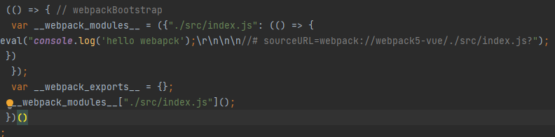

# webpack 使用


## webpack是什么

>webpack 是一个用于现代JavaScript应用程序的静态模块打包工具。
> 当 webpack 处理应用程序时，它会在内部从一个或多个入口点构建一个 依赖图(dependency graph)，然后将你项目中所需的每一个模块组合成一个或多个 bundles，它们均为静态资源，用于展示你的内容


## webpack的核心

- `entry` 入口模块文件路径
- `output` 输出bundle文件路径
- `module` 模块，webpack构建对象
- `bundle` 输出文件，webpack构建产物
- `chunk` 中间文件，webpack构建的中间产物。 一个chunk由多个模块组合而成，用于代码合并与分割
- `loader` 文件转换器
- `plugin` 插件，执行特定任务


## webpack快速构建

1. npm init 初始化项目
2. 创建 src/index.js
3. 创建 public/index.html
4. 安装 npm install -D webpack webpack-cli
5. 创建 webpack.config.js  并填入配置
6. 配置 build 命令为 webpack 
7. 执行 npm run build 完成打包构建

```javascript
const path = require('path')
module.exports = {
  mode: 'development',
  entry: './src/index.js',
  output:{
    path: path.resolve( __dirname,'./dist'),
    filename: 'bundle.js'
  },
}
```


## webpack 打包运行机制

> 对webpack编译后的文件进行分析 如下图。 



原本只有一行文件，打包后出现这么多。删除一下无用的注释 简化。
可以看出 通过 eval 函数输出


## source-map

> 通过 `devtool` 可以等到完全不同的打包源码，会对打包性能有重大影响，

devtool的配置项可以通过官网获取： `https://webpack.docschina.org/configuration/devtool/`
`source-map`的原理 阮一峰老师文章 `https://www.ruanyifeng.com/blog/2013/01/javascript_source_map.html`

### 自己创建不同都 `devtool` 模式都对比

通过webpack.config.js 配置不同都 devtool 打包不同模式都编译文件， 
```js
// webpack.config.js 
const HtmlWebpackPlugin = require('html-webpack-plugin')
const allModes = [
  'eval',
  'eval-nosources-cheap-source-map',
  'eval-nosources-cheap-module-source-map',
  'eval-nosources-source-map',
  'inline-nosources-cheap-source-map',
  'eval-source-map',
  'cheap-source-map',
  'cheap-module-source-map',
  'inline-cheap-source-map',
  'inline-cheap-module-source-map',
  'source-map',
  'inline-source-map',
  'hidden-source-map',
  'hidden-cheap-module-source-map',
  'hidden-cheap-source-map',
  'nosources-source-map'
]
module.exports = allModes.map(item => {
  return {
    devtool: item,
    mode: 'none',
    entry: './src/index.js',
    output: {
      filename: `js/${item}.js`
    },
    module: {
      rules: [
        {
          test: /\.js$/,
          use: {
            loader: 'babel-loader',
            options: {
              presets: ['@babel/preset-env']
            }
          }
        }
      ]
    },
    plugins: [
      new HtmlWebpackPlugin({
        filename: `${item}.html`
      })
    ]
  }
})
```


### 开发过程中对 sourceMap的选择要求

1. 在开发环境中对 sourceMap 的要求是：速度快，调试更友好
2. 想要速度快： eval-cheap-source-map
3. 调试更友好： cheap-module-source-map
4. 这种的选择就是 eval-source-map

5. 生产环境： hidden-source-map


## webpack loader

### 能解决什么问题

>webpack 本身只能处理js文件， 为什么在使用的时候也能处理css png等文件呢？ 这是应为有 `loader` 的转化 将除js文件以外的其他资源转化为js

**以css文件为例**

1. 创建一个css文件，
2. index.js 导入 css文件
3. 运行, 编译不同，无法识别css文件

```css
.div{
    width: 500px;
    height: 500px;
    background: red;
}
```

> 需要对应都 loader转换，  css-loader
在webpack.config.js 配置相关

```js
// npm i css-loader
// webpack.config.js 
module.exports = {
  mode: 'development', // "development", // production
  // devtool: 'source-map', // 编译模式
  entry: './src/index.js',
  output:{
    path: path.resolve( __dirname,'./dist'),
    filename: 'bundle.js'
  },
  module: {
    rules: [
      {test: /.css$/, use: ['css-loader']},
    ]
  },
}
```

> 此时编译通过， 通过运行html 引入编译后文件发现，css文件并没有生效， 这是为什么呢？

通过编译后都源码发现,css-loader 只是间css文件转换了js能调用都模块， 当时并不能使用它
那么此时，我们就需要另一loader 来处理  style-loader 

> npm i style-loader

```js
 module: {
    rules: [
      {test: /.css$/, use: [ 'style-loader','css-loader']},
    ]}
```


#### loader 的特点

> loader 从右到左（从下到上） 执行
> 第一个loader要返回js脚本
> 每一个loader都是一个模块
> 每个loader都是无状态都，确保loader在不同模块转换之间不保存状态

#### 编写一个自己的loader

> 了解都loader都运行机制， 那么我们现在自己编写一个loader

创建一个 banner-loader
```js
 module: {
    rules: [
      {test: /.js$/, use: {
        loader: 'banner-loader',
          options:{
            text:'甲乐',
            filename: path.resolve(__dirname,'banner.js') // 读取配置文件
          }
        }},
    ]}
```
```js
// banner-loader

const loaderUtils=require("loader-utils");
const {validate} = require('schema-utils');
let fs =require('fs')
module.exports = function (source){
  this.cacheable && this.cacheable()
  let option = loaderUtils.getOptions(this)
  let cb = this.async() // 使用异步回调，
  let schema = {
    type:"object",
    properties:{
      text:{
        type: 'string'
      },
      filename:{
        type: 'string'
      }
    }
  }
  validate(schema,option,'banner-loader') // 检验参数格式
  if(option.filename){
    this.addDependency(option.filename); // 自动的添加文件依赖
    fs.readFile(option.filename,'utf8',function (err,data) {
      cb(err,`/**${data}**/${source}`)
    })
  }else {
    cb(null,`/**${option.text}**/${source}`)
  }
}
```


## webpack plugin

plugin解决什么问题？

webpack构建生命周期功能定制问题， webpack本身是一个构建过程的状态机，其自身的核心功能也是构建在loader和plugin的机制上

#### plugin 使用

```js

```


#### webpack hooks
 
 > 通常使用的 2和核心钩子

1. compiler钩子  <https://www.webpackjs.com/api/compiler-hooks/>

> 对实际对构建产物之前处理的 钩子。 编译对象

1. run 开始运行
2. compile 开始编译
3. compilation 创建编译对象
4. make 创建模块对象
5. emit 发射文件
6. done 完成


2. compilation 钩子 <https://www.webpackjs.com/api/compilation-hooks/>
> 资源构建
1. buildModule 创建模块
2. normalModuleLoader 普通模块加载
3. succeedModule 模块加载完成
4. finishModules 所依赖都模块完成
5. seal 封装整理代码
6. opitimze 优化
7. after-seal 封装后


#### 实现一个plugin

```js
class BannerPlugin{
  
  
}

```

