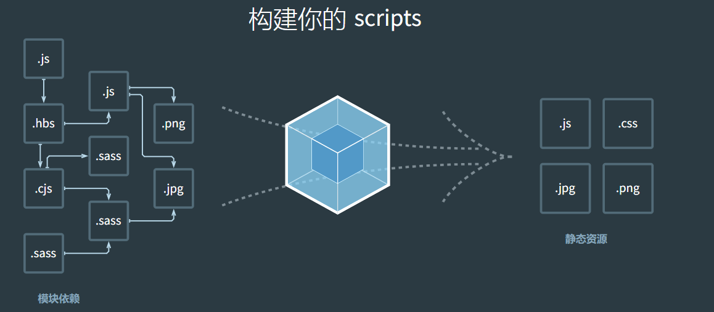

# webpack 使用


## webpack是什么

>webpack 是一个用于现代JavaScript应用程序的静态模块打包工具。
> 当 webpack 处理应用程序时，它会在内部从一个或多个入口点构建一个 依赖图(dependency graph)，然后将你项目中所需的每一个模块组合成一个或多个 bundles，它们均为静态资源，用于展示你的内容



## webpack的核心

- `entry` 入口模块文件路径
- `output` 输出bundle文件路径
- `module` 模块，webpack构建对象
- `bundle` 输出文件，webpack构建产物
- `chunk` 中间文件，webpack构建的中间产物
- `loader` 文件转换器
- `plugin` 插件，执行特定任务


## webpack快速构建

1. npm init 初始化项目
2. 创建 src/index.js
3. 创建 public/index.html
4. 安装 npm install -D webpack webpack-cli
5. 创建 webpack.config.js  并填入配置
6. 配置 build 命令为 webpack 
7. 执行 npm run build 完成打包构建

```javascript
const path = require('path')
module.exports = {
  mode: 'development',
  entry: './src/index.js',
  output:{
    path: path.resolve( __dirname,'./dist'),
    filename: 'bundle.js'
  },
}
```


## webpack 打包运行机制

> 对webpack编译后的文件进行分析 如下图。 


## source-map


> 通过 `devtool` 可以等到完全不同的打包源码，会对打包性能有重大影响，

devtool的配置项可以通过官网获取： `https://webpack.docschina.org/configuration/devtool/`
`source-map`的原理 阮一峰老师文章 `https://www.ruanyifeng.com/blog/2013/01/javascript_source_map.html`


### 开发过程中对 sourceMap的选择要求

1. 在开发环境中对 sourceMap 的要求是：速度快，调试更友好
2. 想要速度快： eval-cheap-source-map
3. 调试更友好： cheap-module-source-map
4. 这种的选择就是 eval-source-map

5. 生产环境： hidden-source-map


## webpack loader

### 能解决什么问题

>webpack 本身只能处理js文件， 为什么在使用的时候也能处理css png等文件呢？ 这是应为有 `loader` 的转化 将除js文件以外的其他资源转化为js


1. 以css文件为例


#### loader 执行顺序

> loader 从右到左（从下到上） 执行

#### 编写一个自己的loader


我们以 


## webpack plugin

plugin解决什么问题？

webpack构建生命周期功能定制问题， webpack本身是一个构建过程的状态机，其自身的核心功能也是构建在loader和plugin的机制上


#### webpack hooks
 
 > 通常使用的 2和核心钩子

1. compiler钩子  <https://www.webpackjs.com/api/compiler-hooks/>

> 对实际对构建产物之前处理的 钩子。 编译之前


2. compilation 钩子 <https://www.webpackjs.com/api/compilation-hooks/>


## watch